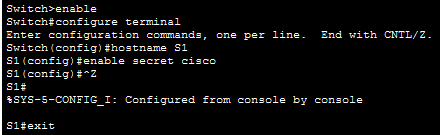
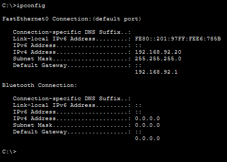
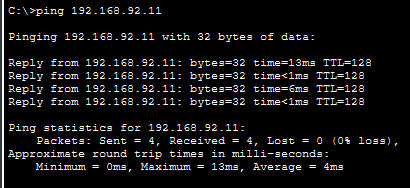
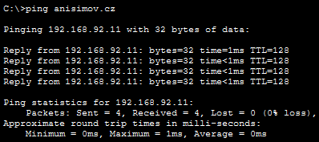
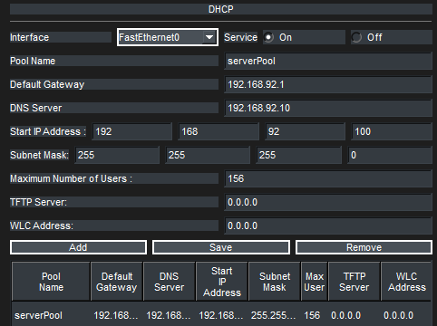
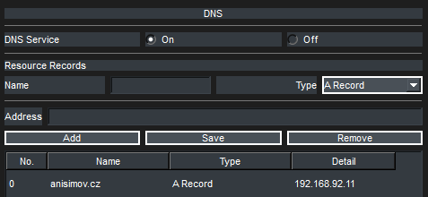
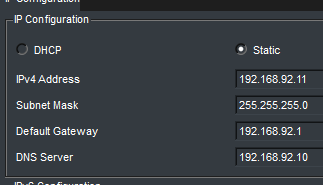
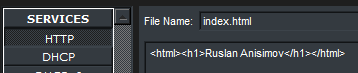

# Projekt LAN - Cisco Packet Tracer

## Popis sítě
Síť se skládá ze dvou segmentů propojených switchi S1 a S2. 
Obsahuje DHCP/DNS server pro správu adres a domén, a Web server s jednoduchou strankou.

## Výpočet X
- Příjmení: ANISIMOV
- ASCII TO DECIMAL
A 	        65
N 	        78
I 	        73
S 	        83
I 	        73
M 	        77
O 	        79
V 	        86
Soucet      604

- 604 / 256 = 2.359
- 2 * 256 = 512
- 604 - 512 = 92
- X = 92

## Screenshoty
### 1. Konfigurace switche z Laptopu

### 2. PC1 - ipconfig

### 3. PC1 - ping na SRV2 (IP i doména)

### 4. Nastavení služeb (DNS, DHCP, WEB)

